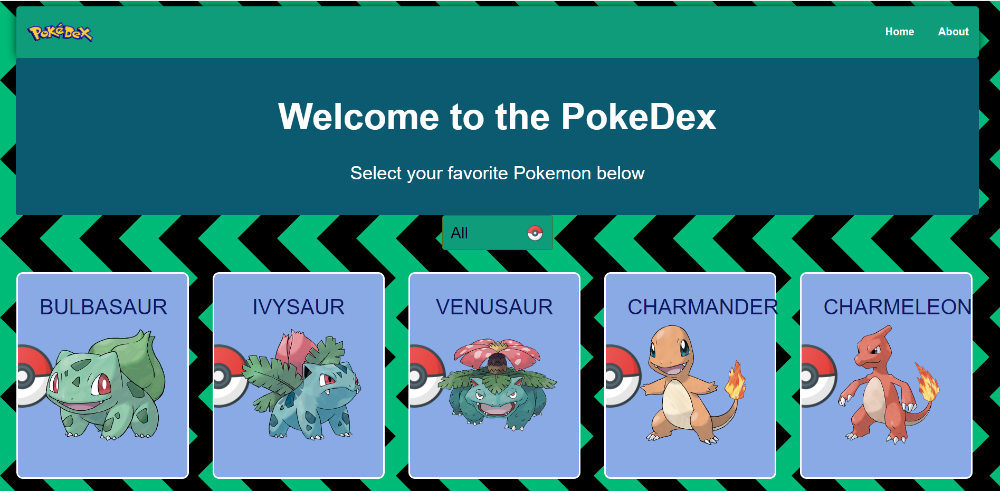
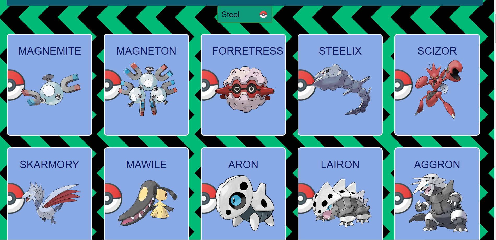
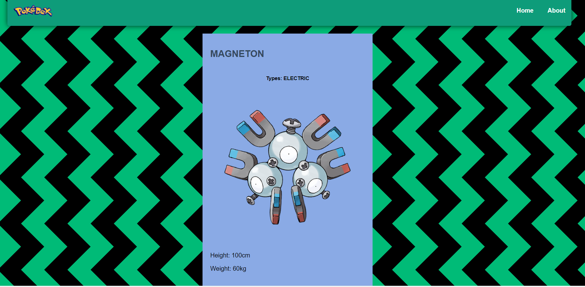

# React-Capstone

> This project is a PokeDex featuring the original Pokemon from Gen1 made with REACT and REDUX.

All the information for the application is pulled from the [PokeAPI](https://pokeapi.co/docs/v2) and filtered to take only the information that is going to be presented. This is a capstone project for the React-Redux module from the Microverse technical curriculum, the specifications from this project come from the **Catalogue of Recipes** capstone.

## Built With

- React,
- Redux,
- Jest,
- PokeAPI,
- Node.js,
- Git flow

## Live Video

[Live Video](https://www.loom.com/share/253b860c352946caa39e82ee8ea64cc7)

## Live Demo

[Live Demo](https://pekedex.netlify.app/)

# How to use it

When you render up the application you are welcomed by the home page that shows the default pokemon.

Below this, you can select the Gen1 pokemon, each of them displaying their name as well as a small image next to it.

Once you click back on the highlighted badge the filter will clear and the full list of pokemon will show again.

Then you click on any of the pokemon listed, you will be taken to the information page for that pokemon, where you can see a bigger image of it and the information about its types, weight, and height.

By clicking the home button on the home page you will go to the list that you had before, either if it was the full list or a filtered one.

## Setup Locally

To run the application locally you will need to follow several steps to make it work.

First, you have to check if you have **nodejs** installed on your machine. For this type the following command in your terminal:

> node -v

If **command not found** shows as a response, then go to [nodejs.org](https://nodejs.org/en/) and follow the instructions to install it. After completing the installation the same command should show you a version number.

Then clone the [repository](https://github.com/Kumilachew-g/react-capstone.git) into your local drive and open a terminal in the root folder of the project and install the necessary packages to make it work by running this command:

> npm install

This will get the project ready to run. After this run the following command to start the development server on **localhost:3000/** and wait for the browser to open:

> npm start

If the browser does not open or you close it by accident, but the server is still running you can type **localhost:3000/** in your address bar to get into the application again.

## Tests

This project has a suite of tests built-in.

To run the tests clone the [repository](https://github.com/Kumilachew-g/react-capstone.git) into your local drive, if you haven't done so, and open a terminal in the root folder of the project and install the necessary packages to make it work by running this command:

> npm install

Then you can just run the following command and see the results

> npm test

## Author

👤 **Kumilachew Getie**

- GitHub: [@githubhandle](https://github.com/Kumilachew-g/)
- Twitter: [@twitterhandle](https://twitter.com/Getie_Haddis)
- LinkedIn: [LinkedIn](https://www.linkedin.com/in/kumilachew-getie/)

## 🤝 Contributing

Contributions, issues, and feature requests are welcome!

Feel free to check the [issues page](https://github.com/Kumilachew-g/react-capstone/issues/).

## Show your support

Give a ⭐️ if you like this project!

## Acknowledgments

- Microverse
- [PokeAPI](https://pokeapi.co/docs/v2)
- The Pokemon Company
- [Dave Ceddia](https://www.youtube.com/channel/UCPrkHuq0i1WflifRXUpvNmg)

## 📝 License

This project is [MIT](https://opensource.org/licenses/MIT) licensed.
